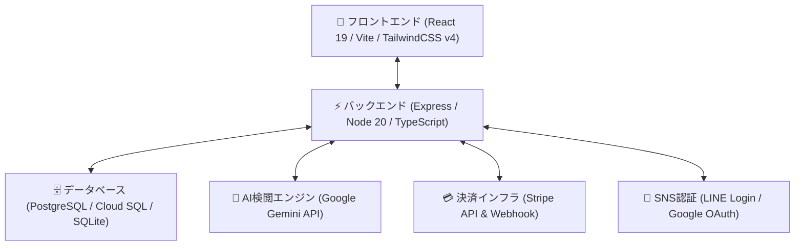

# 🕊️ ReMEETs（再会のボトルメール）

<div align="center">

**「あの頃の想い出」を、もう一度つなぐ。**  
日本の時代と想い出を紡ぐ、安全・安心な再会・感謝マッチングプラットフォーム

[](SECURITY_AUDIT_LOG.md)
[](package.json)
[](package.json)
[](package.json)
[](package.json)

</div>

---

## 🌟 ReMEETs とは？

ReMEETs（リミーツ）は、昔の同級生、恩師、初恋の相手、旅先で出会った知人など、**「もう一度感謝を伝えたい、懐かしい想い出を語り合いたい相手」**に向けて、デジタルなボトルメールを海に流すように投函できるサービスです。

### 🛡️ 徹底したプライバシー＆安心・安全設計
- **秘密の想い出クイズ**: 二人だけしか知り得ないエピソードをクイズに設定。正解者のみがメッセージの開封に進めます。
- **公的身分証（eKYC）認証**: なりすましや悪質利用を防ぐため、受取人・差出人の公的本人確認を徹底。
- **AI リアルタイム安全検閲**: Google Gemini API & 独自NGワード辞書により、誹謗中傷、ストーカー、個人情報の直接記載を自動遮断。
- **法執行機関連携ログ**: 刑事訴訟法第197条に基づく警察照会用データ出力システムを完備。

---

## 🏗️ システムアーキテクチャ



---

## 🚀 クイックスタート (ローカル開発)

### 1. 依存関係のインストール
```bash
npm install
```

### 2. 環境変数の設定
[`.env.example`](.env.example) をコピーして `.env` を作成します。
```bash
cp .env.example .env
```

### 3. 開発サーバーの起動
```bash
npm run dev
```
ブラウザで `http://localhost:3000` を開きます。

---

## 🧪 自動テスト＆セキュリティ監査 (全41項目)

ReMEETsでは、画面配信、E2E決済・退会フロー、セキュリティ負荷耐性、警察照会データ出力まで、すべての品質をワンコマンドで自動検証できます。

```bash
# 全41項目のE2E＆マスター監査テストを一括実行
npm test
```

### 監査・テスト内訳
- **E2E＆画面配信点検**（27項目 PASS）: 主要10画面の配信、登録〜投函〜クイズ〜1,200円決済〜退会・物理消去の全自動検証
- **マスター包括監査**（14項目 PASS）: データ初期化、10並行負荷耐性、警察照会データ出力、Stripe Webhook署名検証

詳細な監査台帳は [`SECURITY_AUDIT_LOG.md`](SECURITY_AUDIT_LOG.md) をご覧ください。

---

## 🐳 本番デプロイ＆運用マニュアル

本番環境（Google Cloud Run / Docker / VPS）へのデプロイ手順および運用開始チェックリストは、[`DEPLOY_GUIDE.md`](DEPLOY_GUIDE.md) にまとめています。

```bash
# 本番プロダクションビルド
npm run build

# コンテナイメージのビルド
docker build -t remeets-app:latest .
```

---

## 📜 ライセンス・法的表記
- **利用規約・プライバシーポリシー**: 2026年8月15日 制定
- **特定商取引法に基づく表記**: [`/company`](http://localhost:3000/company) ページに記載

