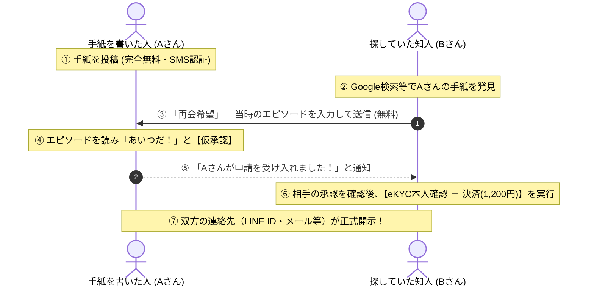

# ReMEETs SeekMe 〜私を探すあなたへ〜 マスター開発・法務仕様書 (Master Specification)

本ドキュメントは、ReMEETsの公式姉妹サービス『**ReMEETs SeekMe（リミーツ・シークミー）**』のサービスコンセプト、画面設計、認証・決済フロー、返金ポリシー、および法的防犯要件を網羅した**完全移行用マスター仕様書**です。
新プロジェクトへの移行・開発開始時は、本仕様書を最優先の前提要件として実装を進めてください。

---

## 🏛️ 1. 基本情報・ブランド設計

- **サービス正式名称**: `ReMEETs SeekMe 〜私を探すあなたへ〜`
- **英語サブタイトル**: `ReMEETs : SeekMe — For the person looking for me —`
- **URL構造**: `https://remeets.jp/seekme/`（サブディレクトリ運用）
  - **SEO戦略**: 親ドメイン（`remeets.jp`）のドメイン評価・信頼性を100%共有し、「人名＋旧姓＋ゆかりの都道府県」でのGoogle検索上位表示を最大化。
- **ブランドの役割分担**:
  - **本家 `ReMEETs`**: 【届ける再会】大切なあの人を指名してボトルメールを海に放つ（アクティブ）
  - **姉妹 `SeekMe`**: 【待つ・迎える再会】私を探している誰かに向けて、自分からの手紙を届けておく（パッシブ・灯台型）

---

## 📜 2. 想い出の手紙のデータ項目・表示設計（シンプル＆プライバシー厳守）

手紙（ボトル）の入力・表示項目は、ユーザーの手間を最小化し、プライバシーを厳格に保護するため**以下の5項目のみ**に絞り込みます。

| 項目名 | 必須/任意 | 内容・公開レベル | 目的・検索性 |
| :--- | :---: | :--- | :--- |
| **1. お名前（フルネーム）** | **必須** | 公開 | 探す人が検索するための主キー |
| **2. 旧姓** | **任意** | 公開 | 結婚等で改姓した同級生・旧友からの発見率を最大化 |
| **3. ゆかりの地** | **必須** | **「都道府県」のみ公開**（市区町村以下は非公開） | 同姓同名の絞り込み（※詳細住所はAIで遮断） |
| **4. メッセージ** | **必須** | 公開（昔の知人・友人への呼びかけ文） | 当時の思い出や温かいメッセージ |
| **5. 連絡の取得方法** | **自動** | システム共通の定型案内を表示 | 訪れた人が迷わず再会申請できる導線 |

### 🚨 【絶対遵守・防犯鉄則】
- **学校名は検索ワードや公開項目には絶対に入れない**。
- 具体的な学校名や職場名は個人特定・防犯のため一般公開リスト・検索インデックスから完全に排除する。
- 検索できるのは**「お名前（苗字・旧姓・あだ名）」「ゆかりの都道府県」「年代」のみ**とする。

---

## 🔄 3. マッチング・本人認証・決済フロー（黄金の5ステップ）

手紙を書いた側（Aさん）の負担をゼロにして投稿数を最大化しつつ、探した側（Bさん）が安心して決済・eKYCできる**相互合意フロー**です。

---

## 💳 4. 料金体系・不承認時の返金ポリシー（特商法・フェア設計）

### (1) 料金内訳（Bさん決済時）
- **手紙開封・連絡先開示手数料**: 600円（税込）
- **公的本人確認（eKYC）審査料**: 600円（税込）
- **決済合計金額**: **1,200円（税込）**

### (2) Aさんが「承認しなかった」または「期限切れ」の場合の返金規定

| 料金項目 | 返金対応 | 法的根拠・実務理由 |
| :--- | :---: | :--- |
| **💌 開封手数料（600円）** | **【全額即時自動返金】** (Stripe Auto-Refund) | 連絡先開示という役務が未提供のため、返金が法的義務。 |
| **🪪 eKYC審査料（600円）** | **【返金不可】** (不返金・適法) | 身元の公的審査自体は申請時に完了し、外部実費が発生しているため適法。 |

#### 🌟 Bさんへの救済・納得感設計:
- eKYC審査をパスしたBさんのアカウントには**「公的本人確認済みバッジ」を永久付与**。
- **次回以降、他の手紙への申請や本家ReMEETsの利用時はeKYC手続き・費用（600円）が永久免除（無料パス）**となるため、無駄金になりません。

---

## ⚖️ 5. 法務・コンプライアンス・防犯クリアランス

本サービスは、以下の5大防犯・法務要件を完全にクリアして運営されます。

1. **出会い系サイト規制法（インターネット異性紹介事業）**:
   - **非該当（届出不要）**。利用規約で「新規の異性交際・恋活・婚活目的」を完全禁止。
   - Gemini AI安全モデレーションにより、出会い系文言・不当な連絡先交換をリアルタイム自動遮断。
2. **個人情報保護法**:
   - 本人が自己の意思で氏名・ゆかりの地を開示することは「自己情報コントロール権」の範囲内であり完全適法。
   - 他人の名前を無断で晒すなりすまし投稿は、SMS/SNS本人認証・AI検閲・ワンクリック通報削除で防止。
3. **ストーカー規制法・迷惑行為防止**:
   - 手紙の主（Aさん）に「ワンクリック拒絶・ブロック機能」を提供。
   - 申請時のIPアドレス・タイムスタンプ・端末情報を改ざん防止監査ログに保全し、警察の捜査照会へ即応。
4. **特定商取引法に基づく表記**:
   - 役務内容、手数料、および上記の「開封料全額返金ポリシー」を決済画面に明記。
5. **未成年者保護**:
   - 18歳未満利用禁止、およびeKYC公的身分証による年齢確認の徹底。

---

## 🎨 6. UI/UX・デザイン方針（手紙ページ＝完結型LP）

### (1) トップページ（ブランド＆実績ポータル）
- 掲示板のような雑多な一覧表示を完全排除し、サイトの品格を守る。
- **3大コンテンツ**:
  1. **実績カウンター**: 「海を漂う想い：〇〇通 ｜ 生まれた再会：〇〇組」
  2. **出会いの感謝の手紙**: 実際に再会したユーザーの温かい成功事例・エピソード
  3. **安心・安全の仕組み図解**: eKYC・相互合意・AI安全検閲の透明性解説

### (2) 手紙の個別ページ（最強のランディングページ）
Google検索から直接着地したユーザーのため、手紙ページ単体で以下の要素を1画面スクロールで提供。
1. **上部**: エモーショナルな手紙デザイン（氏名、旧姓、ゆかりの都道府県、メッセージ）
2. **メインCTA**: 「この人に再会を希望する（エピソード送信）」ボタン
3. **安心解説**: 相互承認制・eKYC本人確認の仕組み図解
4. **サブCTA**: 「あなたも大切な人に向けて手紙を書きませんか？（新規投稿）」

---

## 🚀 7. 新プロジェクト立ち上げ時の開発開始手順

1. **フォルダの複製**: PC上で本プロジェクトをコピーし、フォルダ名を `remeets-seekme` に変更。
2. **Antigravityで開く**: `File > Open Folder...` で `remeets-seekme` を開く。
3. **開発開始プロンプト**: 新しいチャットに以下を送信するだけで全自動で開発がスタートします。

> **【新チャットへの指示プロンプト】**
> 「このプロジェクトはReMEETsの姉妹サイト『ReMEETs SeekMe』です。
> プロジェクト直下にある `SEEKME_MASTER_SPEC.md` を読み込み、この仕様書に沿って画面とAPIのカスタマイズを進めてください。」
